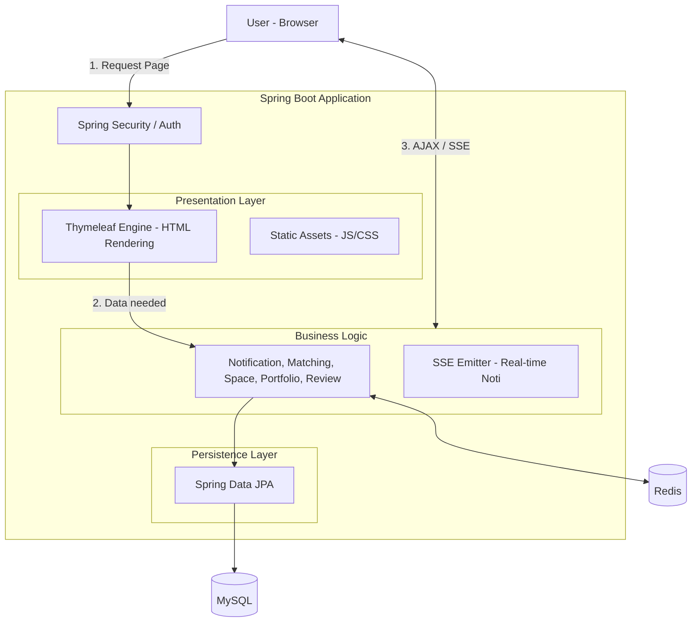

# 🧀 PIECE
가게 안의 유휴공간을 임대하는 초단기 샵인샵(Shop-in-Shop) 매칭 플랫폼

## 📋 프로젝트 소개

Piece는 높은 보증금과 장기 계약 부담 없이 자신의 상품에 대한 오프라인 판매 거점을 확보할 수 있도록 돕습니다. 공간주에게는 월세 부담 완화를, 메이커에게는 팝업 스토어 기회를 제공함으로써 골목 상권 내에서 공간의 재발견과 경제적 상생을 실현하는 온-오프라인 연계(O2O) 웹 서비스를 지향합니다.

## 🏗️ 시스템 아키텍처

## 🧩 ERD

## ✨ 핵심 기능
### 🔐 Auth & User
* **소셜 로그인 및 JWT 인증**: 카카오/구글/네이버 OAuth2.0 로그인 및 Access/Refresh Token 기반 인증 구현
* **보안 강화**: **RTR(Refresh Token Rotation)** 방식을 도입하여 탈취된 토큰의 수명을 제한하고 보안성 강화

### 🤝 Matching System
* **입점 신청 프로세스**: 신청서 작성(CRUD) 및 단계별 상태 관리(수락/거절/취소/완료)
* **데이터 무결성 보장**: **상태 검증 로직(State Validation)**을 적용하여 비정상적인 상태 변경을 원천 차단

### 🔔 Notification
* **실시간 알림 서비스**: 매칭 상태 변경, 문의 등의 이벤트를 실시간으로 전송
* **리소스 최적화**: Polling 방식의 한계를 극복하기 위해 **SSE(Server-Sent Events)**를 도입, 서버 부하를 줄이고
  실시간성 확보

### 📝 Review & Favorite
* **커뮤니티 기능**: 별점, 리뷰 작성 및 관심 공간 찜하기(Wishlist)
* **트랜잭션 최적화**: 찜하기 등 빈번한 요청에 대한 로직을 최적화하여 DB 부하 최소화

### 🏠 Space & Portfolio
* **공간/포트폴리오 관리**: 공간,포트폴리오 게시글(CRUD) 및 다중 이미지 업로드
* **성능 최적화**: **Fetch Join** 및 **Batch Size** 설정을 통해 조회 시 발생하는 **N+1 문제 해결**
* **스토리지 분리**: **AWS S3**를 연동하여 서버 스토리지 용량 한계를 극복하고 이미지를 안정적으로 관리

## 🛠 트러블 슈팅

### 1. Performance Optimization (JPA)

<strong>👉 N+1 문제 해결과 페이징 최적화 전략</strong>

* **문제 상황 (Problem)**
  * 공간 목록 조회(`findAll`) 시 연관된 `User`(ToOne)와 `Image`(ToMany)를 조회하며 **쿼리가 201번(1+100+100) 발생**하는 N+1 문제 직면.
  * 단순히 `Fetch Join`을 모두 적용할 경우, 컬렉션 페이징 시 **Out of Memory** 이슈 발생 위험.

* **해결 및 성과 (Solution & Result)**
  * **ToOne(User)**: `Fetch Join`을 적용하여 즉시 로딩 처리.
  * **ToMany(Image)**: 페이징 메모리 문제를 방지하기 위해 `Fetch Join` 대신 **`@BatchSize(size=100)`** 옵션을 적용.
  * **결과**: `IN` 절을 통해 데이터를 묶어서 조회함으로써 쿼리 수를 획기적으로 줄이고, **대용량 데이터 페이징의 안정성**을 확보함.

<strong>👉 벌크 연산을 통한 대량 데이터 처리 최적화</strong>

* **문제 상황**: 매칭 확정 시, 기간이 겹치는 다른 대기 신청자들의 상태를 변경하기 위해 `Loop`를 돌며 건건이 `Update` 쿼리를 실행 (DB I/O 부하 발생).
* **해결**: **JPQL 벌크 연산**을 도입하여 단 한 번의 쿼리로 상태를 일괄 변경하고, `@Modifying(clearAutomatically = true)`를 설정하여 영속성 컨텍스트 불일치 문제를 방지함.

### 2. Architecture & Design Pattern

<strong>👉 이벤트 기반 아키텍처(Event-Driven)로 서비스 결합도 감소</strong>

* **문제 상황 (Problem)**
  * `MatchingService` 내부에서 알림 발송을 위해 `NotificationService`를 직접 호출함에 따라 **강한 결합도(Tight Coupling)** 발생.
  * 매칭 트랜잭션 내에 외부 로직(알림)이 포함되어 트랜잭션 경계가 모호해짐.

* **해결 및 성과 (Solution & Result)**
  * **Spring Event**를 도입하여 관심사를 분리.
    1. 매칭 로직 완료 후 `MatchingSuccessEvent` 발행.
    2. `EventListener`가 이를 구독하여 알림 로직을 비동기/동기로 수행.
  * **결과**: 핵심 비즈니스 로직과 부가 기능(알림)을 분리하여 **유지보수성을 높이고 트랜잭션 관리의 유연성**을 확보.

<strong>👉 단일 책임 원칙(SRP)에 따른 인프라 로직 분리</strong>

* **문제 상황**: `SpaceService` 내부에 S3 이미지 업로드 코드가 혼재되어 비즈니스 로직 파악이 어렵고 테스트가 복잡함.
* **해결**: 이미지 처리 로직을 `ImageService`로 위임(Delegate)하고, API 요청 시 `multipart/form-data`와 JSON을 동시에 처리하도록 구조를 개선하여 네트워크 왕복(RTT) 비용을 절감함.

### 3. Data Consistency (Distributed Environment)

<strong>👉 S3 스토리지와 DB 간의 데이터 정합성 보장</strong>

* **문제 상황 (Problem)**
  * 트랜잭션 롤백 시 DB 데이터는 복구되지만, 외부 스토리지(S3)의 파일은 이미 삭제되어 **고아 파일(Orphaned File)**이 발생하거나 복구가 불가능한 문제.

* **해결 및 성과 (Solution & Result)**
  * **Soft Delete** 도입: 물리적 삭제 대신 `is_deleted = true` 플래그를 사용하여 논리적 삭제 처리.
  * **Eventual Consistency**: 실제 S3 파일 삭제는 실시간 트랜잭션에서 분리하여, **스케줄러(Batch)**를 통해 주기적으로 정리하는 방식으로 설계.
  * **결과**: 데이터 복구 가능성을 열어두고, 불필요한 I/O 대기를 줄여 **사용자 응답 속도를 개선**함.

### 4. Security & Resource Efficiency

<strong>👉 보안과 효율성을 고려한 Redis 및 식별자 전략</strong>

* **Redis 자원 최적화**: 로그아웃 시 Access Token의 전체 수명이 아닌, **남은 유효 시간(TTL)만 계산**하여 Redis 블랙리스트에 저장함으로써 불필요한 메모리 낭비를 방지함.
* **식별자 이원화 전략**: 외부 노출 시 보안을 위해 **UUID**를 사용하고, 내부 DB 성능(Join)을 위해 **PK(Long)**를 사용하는 이원화 전략을 채택하여 **보안과 성능의 Trade-off 균형**을 맞춤.

